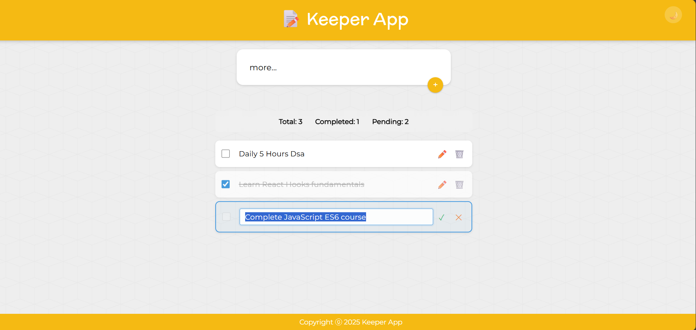
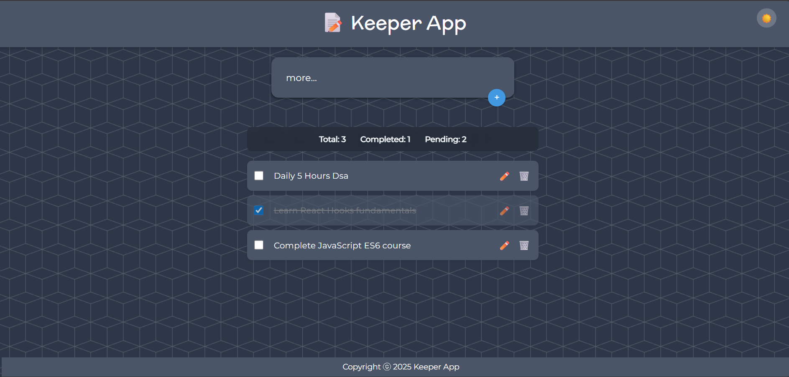

# 📝 Keeper App - React Todo List

A modern, feature-rich todo application built with React.js featuring beautiful UI, drag & drop functionality, light/dark theme support, and seamless editing capabilities.





## ✨ Features

- ✅ **Add, Edit, Delete Todos** - Complete CRUD functionality with inline editing
- 🎯 **Mark as Complete** - Toggle completion status with animated checkboxes
- 🎨 **Light/Dark Theme** - Beautiful theme switching with smooth transitions
- 🔄 **Drag & Drop** - Intuitive reordering with visual feedback
- 📱 **Responsive Design** - Perfect experience on desktop, tablet, and mobile
- 💾 **Local Storage** - Todos persist between browser sessions
- ⚡ **Real-time Stats** - Live count of total, completed, and pending todos
- 🎭 **Smooth Animations** - Elegant transitions and micro-interactions
- 🎯 **Enhanced Editing** - Double-click to edit with keyboard shortcuts
- 🚫 **Right-click Protection** - Improved editing experience without interference
- 📊 **Visual Feedback** - Clear indicators for all interactive states

## 🛠️ Tech Stack

- **Frontend**: React.js 18+ (Functional Components + Hooks)
- **Styling**: CSS3 with custom properties and animations
- **State Management**: React useState & useEffect hooks  
- **Storage**: localStorage for data persistence
- **Build Tool**: Create React App
- **Font**: Montserrat & McLaren (Google Fonts)
- **Icons**: Emoji-based icons for universal compatibility

## 🚀 Quick Start

### Prerequisites
- Node.js (v14 or higher)
- npm (v6 or higher) or yarn

### Installation

1. **Clone the repository**
   ```bash
   git clone https://github.com/yourusername/keeper-app.git
   cd keeper-app
   ```

2. **Install dependencies**
   ```bash
   npm install
   # or
   yarn install
   ```

3. **Start development server**
   ```bash
   npm start
   # or  
   yarn start
   ```

4. **Open your browser**
   Navigate to `http://localhost:3000`

## 📁 Project Structure

```
keeper-app/
├── public/
│   ├── index.html          # Main HTML file
│   └── favicon.ico         # App icon
├── src/
│   ├── index.js           # App entry point
│   ├── styles.css         # Global styles and themes
│   └── components/
│       ├── App.jsx        # Main app component with state management
│       ├── Header.jsx     # App header with title and theme toggle
│       ├── TodoForm.jsx   # Form component for adding new todos
│       ├── TodoList.jsx   # Container component with stats display
│       ├── TodoItem.jsx   # Individual todo item with all interactions
│       ├── ThemeToggle.jsx # Theme switching component
│       └── Footer.jsx     # App footer with copyright
├── package.json
├── README.md
└── .gitignore
```

## 🎮 Usage Guide

### Adding Todos
- Type your todo in the input field at the top
- Press **Enter** or click the **+** button to add
- Todos are automatically saved to local storage

### Managing Todos
- **Complete**: Click the checkbox to mark as done/undone
- **Edit**: Double-click on the todo text to edit inline
  - Press **Enter** to save changes
  - Press **Escape** to cancel editing
- **Delete**: Click the 🗑️ trash icon to remove
- **Reorder**: Drag and drop todos to change their order

### Theme Switching
- Click the **🌙/☀️** icon in the header to toggle themes
- Theme preference is automatically saved and restored

### Keyboard Shortcuts
- **Enter**: Save changes when editing
- **Escape**: Cancel editing
- **Double-click**: Start editing any todo

## 🔧 Available Scripts

In the project directory, you can run:

### `npm start`
Runs the app in development mode.\
Open [http://localhost:3000](http://localhost:3000) to view it in the browser.

The page will reload if you make edits.\
You will also see any lint errors in the console.

### `npm test`
Launches the test runner in interactive watch mode.

### `npm run build`
Builds the app for production to the `build` folder.\
It correctly bundles React in production mode and optimizes the build for best performance.

### `npm run eject`
**Note: this is a one-way operation. Once you `eject`, you can't go back!**

## 🌟 Key Features Deep Dive

### Component Architecture
- **Functional Components**: All components use modern React hooks
- **Props & State**: Clean unidirectional data flow
- **Separation of Concerns**: Each component has a single responsibility
- **Reusability**: Components designed for easy reuse and extension

### State Management
- **useState**: Component-level state for todos, theme, editing states
- **useEffect**: Side effects for localStorage, theme application, focus management
- **useRef**: Direct DOM manipulation for input focus and selection
- **Local Storage**: Persistent data storage across browser sessions

### Enhanced User Experience
- **Visual Feedback**: Clear indicators for all interactive states
- **Smooth Animations**: CSS transitions and micro-interactions
- **Accessibility**: Keyboard navigation and screen reader support
- **Error Prevention**: Input validation and confirmation dialogs

## 🤝 Contributing

Contributions are welcome! Please feel free to submit a Pull Request.

### Development Setup
1. Fork the project
2. Create your feature branch (`git checkout -b feature/AmazingFeature`)
3. Make your changes
4. Add screenshots if UI changes are involved
5. Commit your changes (`git commit -m 'Add some AmazingFeature'`)
6. Push to the branch (`git push origin feature/AmazingFeature`)  
7. Open a Pull Request

### Contribution Guidelines
- Follow existing code style and conventions
- Add comments for complex logic
- Update documentation for new features
- Include screenshots for UI changes
- Test on both desktop and mobile
- Verify both light and dark themes work properly

## 🐛 Bug Reports

Found a bug? Please open an issue with:
- **Description**: Clear description of the bug
- **Steps to Reproduce**: Detailed steps to trigger the issue
- **Expected Behavior**: What should have happened
- **Screenshots**: Visual evidence of the problem
- **Environment**: Browser, OS, screen size details
- **Console Errors**: Any JavaScript errors from browser console

## 📝 License

This project is licensed under the MIT License - see the [LICENSE](LICENSE) file for details.

## 👨‍💻 Author

**Your Name**
- GitHub: [@yourusername](https://github.com/yourusername)
- LinkedIn: [Your LinkedIn](https://linkedin.com/in/yourprofile)
- Email: your.email@example.com
- Portfolio: [yourwebsite.com](https://yourwebsite.com)

## 🙏 Acknowledgments

- [React.js](https://reactjs.org/) - The amazing JavaScript library
- [Google Fonts](https://fonts.google.com/) - Montserrat and McLaren fonts
- [Transparent Textures](https://www.transparenttextures.com/) - Background patterns
- [Emojipedia](https://emojipedia.org/) - Emoji icons and references
- Community feedback and contributions

## 🔮 Roadmap & Future Enhancements

- [ ] **Backend Integration**
  - [ ] REST API with Node.js/Express
  - [ ] Database integration (MongoDB/PostgreSQL)
  - [ ] User authentication and profiles

- [ ] **Advanced Features**  
  - [ ] Categories and tags for todos
  - [ ] Due dates and calendar integration
  - [ ] Priority levels and sorting
  - [ ] Search and filter functionality
  - [ ] Bulk operations (select multiple)

- [ ] **Collaboration**
  - [ ] Shared todo lists
  - [ ] Real-time updates with Socket.io
  - [ ] Comments and mentions
  - [ ] Team workspaces

- [ ] **Mobile & Desktop Apps**
  - [ ] React Native mobile app
  - [ ] Electron desktop app  
  - [ ] PWA with offline support
  - [ ] Push notifications

- [ ] **Import/Export**
  - [ ] CSV/JSON export
  - [ ] Import from other todo apps
  - [ ] Backup and restore
  - [ ] Sync across devices

## ⭐ Support

If this project helped you, please give it a ⭐ on GitHub!

---

**Happy organizing! 📝✨**
